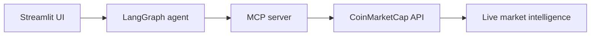

# Local Development Demo — Streamlit App

This demo shows the project running locally through a Streamlit chat interface connected to the MCP server and live CoinMarketCap data.

## Overview



The local demo is designed to feel like a real analyst workflow:

- ask a natural-language question
- let the agent choose the right MCP tool
- fetch live market data from CoinMarketCap
- return a concise, evidence-based answer

## Example prompt

> "Resolve PAXG to its parent asset and compare the tokenized gold ecosystem against BTC and ETH."

## Live result summary

### 1) Asset resolution

`PAXG` resolves to the canonical parent asset `Gold` with symbol `GOLD`.

### 2) Gold token ecosystem

| Symbol | Name | Issuer | Normalized price / oz |
|---|---|---|---:|
| PAXG | PAX Gold | Paxos | $4,361.09 |
| XAUt | Tether Gold | Tether Holdings | $4,371.25 |
| XAUM | Matrixdock Gold | Matrixdock | $4,362.54 |
| CGO | Comtech Gold | Comtech Gold | $4,338.30 |
| VNXAU | VNX Gold | VNX | $4,283.52 |
| XAUT0 | Tether Gold Tokens | Tether Holdings | $4,366.59 |
| XAU | Gold Derivatives | NA (Derivatives) | $4,374.17 |

### 3) Market structure comparison

| Metric | PAXG | BTC | ETH |
|---|---:|---:|---:|
| Price | $4,365 | $81,272 | $2,635 |
| Market cap | $1.90B | $1.63T | $322B |
| 24h volume | $60.9M | $20.6B | $10.0B |
| V/MC ratio | 3.28% | 1.26% | 3.12% |
| 24h change | -0.14% | +0.39% | +0.98% |

### 4) Key insight

The tokenized gold market is much smaller than BTC and ETH in absolute terms, but it shows stronger relative trading activity per unit of market cap. That makes it more active on a normalized liquidity basis while still remaining far smaller in total scale.

## Global crypto context

| Metric | Value |
|---|---:|
| BTC dominance | 58.78% |
| ETH dominance | 11.57% |
| Total crypto market cap | $2.78T |
| Total 24h volume | $71.96B |
| Tokenized gold market cap | $4.71B |
| Tokenized gold penetration | ~0.17% |

## Visual summary

```mermaid
xychart-beta
    title Tokenized Gold vs BTC/ETH market scale
    x-axis [PAXG, BTC, ETH]
    y-axis "Market Cap (USD)" 0 --> 1800000000000
    bar [1900000000, 1632497865095, 321603568964]
```

```mermaid
xychart-beta
    title Relative liquidity (Volume / Market Cap)
    x-axis [PAXG, BTC, ETH]
    y-axis "V/MC Ratio (%)" 0 --> 5
    bar [3.28, 1.26, 3.12]
```

## Why this demo matters

- it proves the agent can resolve an RWA token correctly
- it combines analyst-style market comparison with live MCP evidence
- it surfaces real values instead of generic financial commentary
- it demonstrates the utility of structured tool access for finance use cases

## Run locally

```bash
streamlit run tests/streamlit_app.py
```

This demo is designed to be presentation-friendly: it reads like an executive summary while still exposing the underlying tool-based evidence behind the result.

---

## Demo notes

- Backend: `tests/agent.py`
- MCP bridge: `app.server`
- Data source: CoinMarketCap API
- Tools exposed: `resolve_rwa_asset`, `get_rwa_market_quote`, `compare_rwa_vs_crypto`, `get_rwa_issuers_info`, `get_global_market_metrics`
