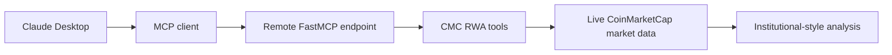
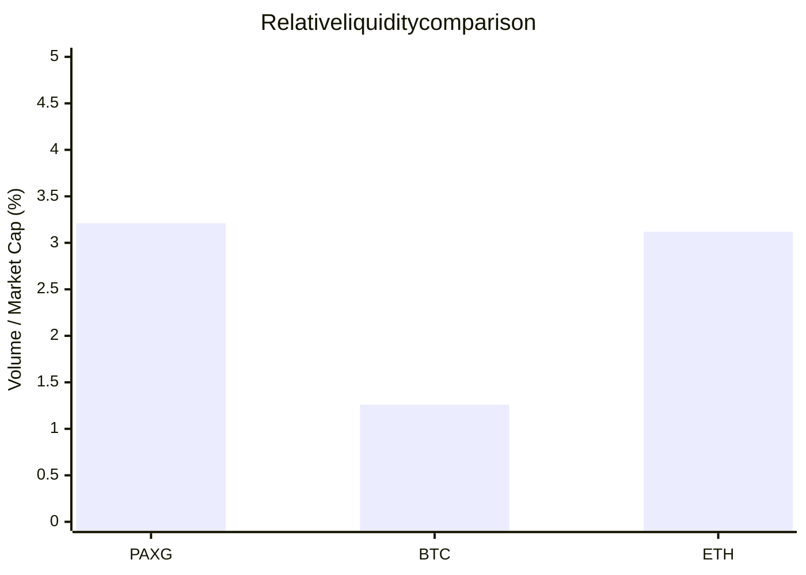
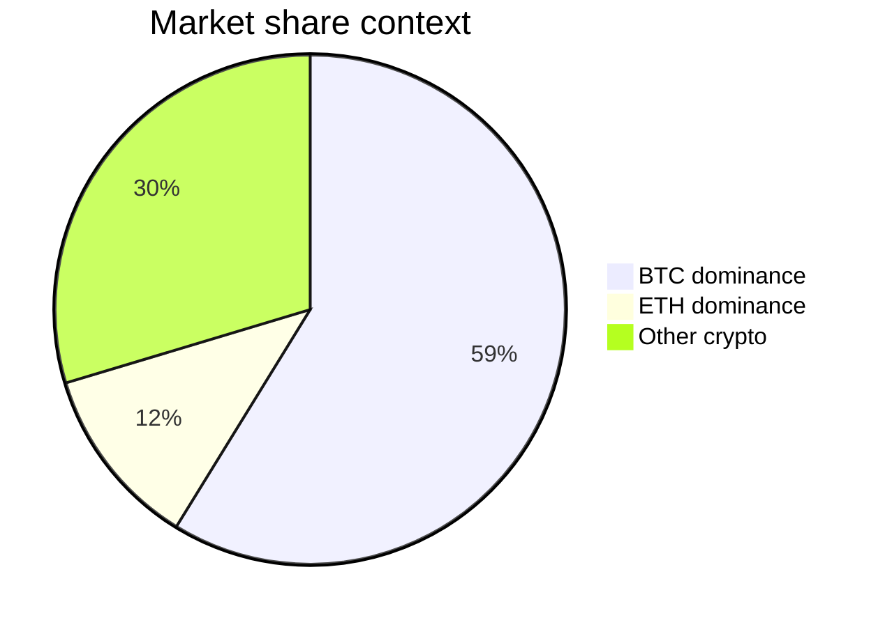

# Remote Demo — Claude Desktop + MCP

This demo shows the same CMC RWA intelligence running through a remote MCP client flow, where Claude can call the live market tools directly and respond in natural language with evidence-backed analysis.

## Demo architecture



## Example request

> "Compare tokenized gold with BTC and ETH, and explain the market context."

## Live summary

### Asset resolution

The agent resolves `PAXG` to the parent asset `Gold (GOLD)` and identifies the token as `PAX Gold` issued by Paxos.

### Comparison with Bitcoin

| Metric | PAXG | BTC |
|---|---:|---:|
| Price | $4,365 | $81,311 |
| Market cap | $1.90B | $1.63T |
| 24h volume | $60.9M | $20.5B |
| V/MC ratio | 3.21% | 1.26% |
| 24h change | -0.14% | +0.52% |

Key finding: BTC is roughly 860x larger than PAXG by market cap, but PAXG shows materially higher relative turnover.

### Comparison with Ethereum

| Metric | PAXG | ETH |
|---|---:|---:|
| Price | $4,365 | $2,635 |
| Market cap | $1.90B | $322B |
| 24h volume | $60.7M | $10.0B |
| V/MC ratio | 3.20% | 3.12% |
| 24h change | -0.14% | +0.98% |

Key finding: ETH is around 170x larger than PAXG by market cap, while the two assets show similar relative liquidity efficiency.

### Global market backdrop

| Metric | Value |
|---|---:|
| BTC dominance | 58.78% |
| ETH dominance | 11.57% |
| Total crypto market cap | $2.78T |
| Total 24h volume | $71.96B |
| Active cryptocurrencies | 8,164 |

## Interpretation

The remote MCP demo demonstrates a strong pattern:

- tokenized gold is a niche but liquid RWA segment
- BTC remains the dominant market leader by a wide margin
- PAXG and ETH show comparable relative liquidity, while BTC is much larger but less turnover-efficient on a normalized basis

## Visual summary





## Tools used in the demo

The agent calls the live MCP tools exposed by the server:

- `resolve_rwa_asset`
- `compare_rwa_vs_crypto`
- `get_global_market_metrics`

These tool calls ground the response in actual live data rather than static examples.

## Example tool evidence

```json
{
  "rwa_id": 1,
  "name": "Gold",
  "symbol": "GOLD",
  "resolved_via": "token_symbol",
  "matched_token": {
    "symbol": "PAXG",
    "name": "PAX Gold",
    "issuer_name": "Paxos"
  }
}
```

This is the kind of evidence the MCP layer provides to the LLM before it drafts the final answer.

## Demo takeaway

This is a good investor-facing demo because it blends:

- asset resolution
- cross-asset comparison
- macro market context
- clear narrative on market structure and liquidity

It feels like a real analyst workflow, not a raw log dump.

---

## Remote endpoint

- MCP endpoint: `https://cmcserver.fastmcp.app/mcp`
- Health/status: `https://cmcserver.fastmcp.app/`

This is the deployed endpoint used by remote clients such as Claude Desktop and MCP-compatible assistants.
