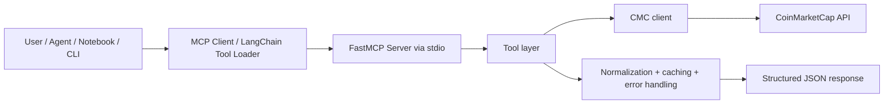

# Architecture Overview

This project is a Python-based MCP server for CoinMarketCap-powered Real-World Asset (RWA) intelligence. It exposes production-style tool endpoints for resolving RWA symbols, fetching quote data, comparing RWAs against crypto assets, listing issuers, and retrieving global market metrics.

The system is designed around a single principle: user-facing RWA symbols are often tokenized child assets, while CoinMarketCap’s canonical market data is usually attached to the parent RWA asset. The architecture therefore resolves token symbols like `PAXG` to the proper parent asset record before quoting or comparison.

---

## 1. High-level system design

The project follows a layered architecture:

- Application config and environment layer
- CoinMarketCap HTTP client layer
- Domain logic layer for RWA and crypto tools
- MCP server layer that exposes tools over stdio
- Agent/test/UI consumers that connect to the server and invoke tools

---

## 2. Project structure and responsibilities

### `app/`

Main application package.

- `app/config.py`
  - Loads `.env` using `python-dotenv`
  - Exposes environment-backed settings, especially `CMC_API_KEY`
  - Provides the central application config object used by the client and server

- `app/server.py`
  - Bootstraps the FastMCP server
  - Registers the tool endpoints exposed to connected clients
  - Validates tool input and returns JSON payloads
  - Runs over stdio transport for MCP compatibility

- `app/cmc/client.py`
  - Thin async wrapper over `httpx.AsyncClient`
  - Handles base URL, API key, timeouts, and domain-specific exceptions
  - Encapsulates calls to CMC endpoints for RWAs, issuers, crypto quotes, and global metrics

- `app/tools/`
  - Contains the business logic for each tool
  - Normalizes deeply nested and inconsistent API payload shapes from CMC
  - Resolves canonical RWA data when tokenized symbols are used
  - Caches expensive or repeat lookups

- `app/utils/`
  - Utility helpers such as shared cache and logging

### `tests/`

- `tests/agent.py`
  - Connects to the MCP server over stdio
  - Loads LangChain MCP tools
  - Builds the agent model using environment variables
  - Keeps MCP subprocess environment isolated to `CMC_API_KEY`

- `tests/test_tools.py`, `tests/test_agent_graph.py`, `tests/test_cmc_client.py`
  - Validate tool behavior, MCP integrations, and API handling

- `tests/testing_all_tools.ipynb`
  - Notebook-based smoke testing harness for direct stdio tool invocation

### `docs/`

- `docs/architecture.md`
  - System documentation
- `docs/api_feedback.md`
  - Operational notes and API behavior feedback
- `docs/evidence/`
  - Example JSON outputs from successful tool calls

---

## 3. Configuration and environment model

The application expects a `.env` file at the project root.

Required runtime configuration includes:

- `CMC_API_KEY`
  - Required for the server and all live API calls
- Optional model variables for external LLM tests and agent flows
  - `OPENAI_API_KEY`
  - `MODEL_BASE_URL`
  - `LLM_MODEL`
  - `AZURE_OPENAI_DEPLOYMENT` or `MODEL_DEPLOYMENT`

Important design decision:

- `CMC_API_KEY` must be present inside the MCP subprocess environment
- model-specific keys remain in the local agent/testing process rather than the MCP server process

This separation prevents the MCP subprocess from inheriting unrelated secrets and keeps the server focused on API access only.

---

## 4. Core runtime flow

### 4.1 MCP server startup

The server is started as a stdio process:

- `app.server` is invoked via Python module execution
- it creates a `FastMCP` instance named `CMC Real-World Asset Intelligence`
- it registers tool functions with names such as:
  - `resolve_rwa_asset`
  - `get_rwa_market_quote`
  - `compare_rwa_vs_crypto`
  - `get_rwa_issuers_info`
  - `get_global_market_metrics`

The server runs with `transport="stdio"`, which makes it compatible with MCP clients and tool loading adapters.

### 4.2 Tool invocation

An MCP client connects to the server and asks for tools. The server returns callable tool definitions to the client. The actual execution path is:

1. client invokes a tool
2. FastMCP dispatches to the registered Python function
3. the tool function calls the relevant domain helper
4. the helper performs one or more CMC API requests
5. data is normalized and returned as JSON-compatible output

The tool wrapper functions in `app/server.py` intentionally return serialized JSON strings to keep the interface compatible with the agent/tool ecosystem.

---

## 5. CoinMarketCap client layer

The `CMCClient` class in `app/cmc/client.py` is the single integration boundary for CMC API access.

### Responsibilities

- initialize the `httpx.AsyncClient` lazily
- attach the required `X-CMC_PRO_API_KEY` header
- set a consistent timeout and base URL
- translate HTTP errors into app-specific exceptions

### Exception mapping

The client converts HTTP failure states into explicit exceptions such as:

- `CMCBadRequestError`
- `CMCUnauthorizedError`
- `CMCNotFoundError`
- `CMCRateLimitError`
- `CMCApiError`

This makes the tool layer and CLI demo script able to report failures clearly and handle auth, rate limits, and invalid parameters in a controlled way.

### Endpoints used

The implementation calls these CMC endpoints:

- `/v5/real-world-assets/quotes/latest`
- `/v5/real-world-assets/issuers/list`
- `/v5/real-world-assets/issuers`
- `/v3/cryptocurrency/quotes/latest`
- `/v1/global-metrics/quotes/latest`

---

## 6. RWA resolution design

This is one of the most important parts of the system.

### Problem

CMC often exposes tokenized RWA assets as child tokens under a canonical parent asset, rather than treating the token symbol as the parent asset itself.

Examples:

- `PAXG` is not necessarily a top-level RWA quote object by itself
- its canonical parent may be `GOLD`
- without mapping, a direct symbol lookup can fail or return the wrong object

### Solution

The function `resolve_rwa_asset()` in `app/tools/resolve_rwa_asset.py` does the following:

1. trims and uppercases the input symbol
2. checks a short-lived in-memory cache for a previously resolved result
3. attempts a direct RWA lookup using `get_rwa_quotes(symbol=...)`
4. if that fails, traverses the RWA issuer listing and issuer token records
5. finds the token whose symbol matches the requested symbol
6. fetches the parent asset metadata for that token
7. returns the canonical `rwa_id` and parent metadata

This allows calls such as:

- `resolve_rwa_asset("GOLD")` -> returns the canonical asset
- `resolve_rwa_asset("PAXG")` -> resolves to the parent RWA record behind the token

### Why this matters

The rest of the system depends on canonical `rwa_id` values for quoting and comparisons.

Without this resolution layer, a comparison between an RWA token and BTC would often break or produce invalid requests.

---

## 7. Quote and comparison logic

### `get_rwa_market_quote`

The tool in `app/tools/get_rwa_market_quote.py`:

- accepts an asset identifier or symbol
- resolves a token symbol to the canonical parent RWA if needed
- fetches the final quote payload from CMC
- extracts the most relevant fields such as:
  - `average_tokenized_price`
  - `tokenized_market_cap`
  - `tokenized_volume_24h`
  - token list and metadata
  - `tradfi_markets`

It returns a normalized dictionary with both financial metrics and token-level details.

### `compare_rwa_vs_crypto`

The comparison tool in `app/tools/compare_rwa_vs_crypto.py` is the system’s synthesis layer.

It performs the following steps:

1. resolves the requested RWA symbol to canonical metadata
2. fetches the RWA quote and the crypto quote concurrently
3. normalizes highly variable payload shapes from CMC
4. extracts the relevant quote blocks even when CMC returns nested or ID-keyed dicts
5. calculates a market-cap ratio between crypto and the RWA
6. returns a clean comparison summary and metrics payload

The key defensive logic is in the helper functions:

- `_normalize_rwa_payload`
- `_extract_token_by_symbol`
- `_normalize_crypto_payload`

These functions are designed to handle list-or-dict payload variations without crashing.

---

## 8. Issuer and global metrics tools

### `get_rwa_issuers_info`

This tool fetches the official RWA issuer list and formats it into a clean summary:

- issuer ID
- issuer name
- website
- token count

It uses a short TTL cache so repeated calls do not hammer the API unnecessarily.

### `get_global_market_metrics`

This returns macro-level crypto indicators, including:

- BTC dominance
- ETH dominance
- active cryptocurrency count
- total market cap
- total 24h volume
- last updated timestamp

This tool is cached because it represents a market snapshot rather than a per-asset live quote.

---

## 9. Caching strategy

The project uses an in-memory cache in `app/utils/cache.py` and custom tool-level caches in the tool modules.

### Why cache?

- repeated symbol resolution is common
- issuer metadata changes infrequently
- global market metrics do not need to be refetched on every single agent call
- this reduces latency and API usage while preserving response freshness

The cache strategy is intentionally conservative:

- short TTL for symbol resolution and issuer lookups
- moderate TTL for global metrics
- strict invalidation based on timestamp

---

## 10. Error handling and observability

### Tool-level error behavior

Each tool in `app/server.py` wraps external logic in a try/except block and returns structured JSON errors rather than raw tracebacks.

This is important for MCP consumption because agent callers often expect a JSON-like payload that is easy to parse and explain.

### Logging

The project uses a logger in `app/utils/logging.py` and logs failures at the tool and server boundary.

### CLI and demo behavior

The script in `app/scripts/demo_query.py` is a proving harness that runs all five tools against the live CMC API and prints the results. It is intended for end-to-end smoke testing and submission evidence.

It catches and reports:

- auth issues
- rate limits
- invalid API parameters
- runtime exceptions

---

## 11. Agent and MCP integration

The project is built to integrate with agents and LangChain-based systems.

### `tests/agent.py`

This module does the following:

- loads environment variables
- builds the MCP stdio connection
- launches the server as a subprocess
- loads LangChain tools from MCP
- creates a ReAct agent with `create_react_agent`
- invokes queries against the full set of RWA tools

The model configuration supports both OpenAI and Azure configurations:

- `OPENAI_API_KEY` or `AZURE_OPENAI_API_KEY`
- `MODEL_BASE_URL`
- `LLM_MODEL`
- Azure deployment detection via `AZURE_OPENAI_DEPLOYMENT` or `MODEL_DEPLOYMENT`

This design allows the system to be tested through a real agent while keeping the MCP server itself focused on CMC access.

---

## 12. Security and operational boundaries

The design intentionally keeps sensitive keys separated by process boundary:

- the MCP subprocess receives only `CMC_API_KEY`
- model credentials stay in the runtime that hosts the LLM agent

This reduces the chance of leaking unrelated keys into the server process and keeps the deployment safer in production-style use.

---

## 13. Verified runtime behavior

The project has been validated in the current workspace with live script execution:

- `python -m app.scripts.demo_query --help` works successfully
- direct script execution via the venv Python works successfully
- the server can start and expose 5 tools over MCP stdio

This confirms the architecture is functioning end-to-end at the process and tool layer, with the main remaining external dependency being the validity of the configured external LLM deployment and API credentials when using the agent model.

---

## 14. Typical request flow

A real user request such as:

- “Compare tokenized gold to Bitcoin”

moves through the system like this:

1. The client calls `compare_rwa_vs_crypto` over MCP
2. the tool resolves `PAXG` or `GOLD` to the canonical asset
3. the tool requests the parent RWA quote
4. the tool requests the BTC quote from the crypto endpoint
5. both payloads are normalized and compared
6. the result is returned as a clean structured JSON object showing:
   - market cap ratio
   - asset price
   - volume
   - normalized labels

This is the central business flow the project is built to support.

---

## 15. Summary

This project is a modern, layered MCP application for RWA and crypto intelligence.

Its core strengths are:

- canonical RWA resolution for tokenized assets
- resilient normalization of CMC payloads
- asynchronous API integration through a single client
- clean MCP tool exposure over stdio
- small but effective caching for performance and reduced API load
- agent-friendly JSON interface for AI orchestration

Its architecture is intentionally simple, reliable, and modular: each subsystem has a clear responsibility, and the boundaries are designed to support both direct CLI execution and model-driven tool invocation.
